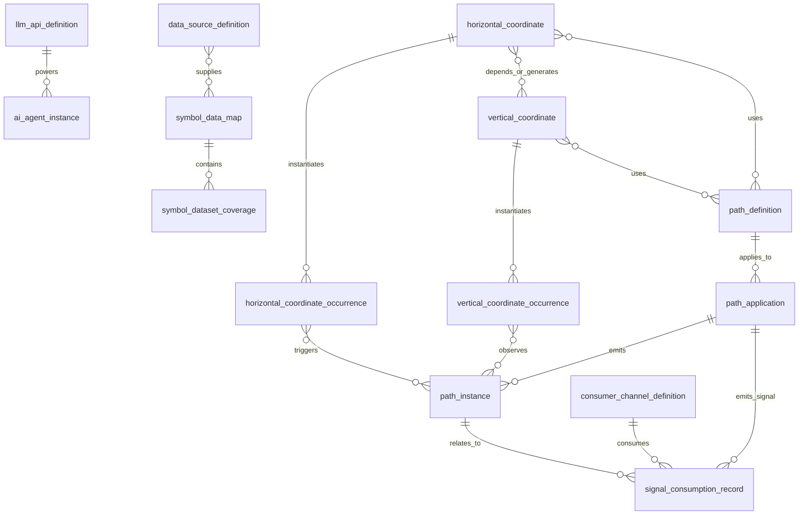

# Path Harness Entity Spec

本规范用于约束原型和后续系统写入。所有爬虫、Agent、n8n workflow、本地 harness、人工导入工具写入这些实体时，都必须先按本 spec 做字段规范化和引用校验。

## 1. 核心原则

1. 关系字段只写规范 ID，不写中文标签、解释短语或临时别名。
2. 定义表保存抽象规律和框架语言，不保存具体日期、具体行情值或事后挑选的结果。
3. 实例表保存某个定义在实盘或回放中的实际发生，但原型样例仍使用“周一”“周五”“事件后”等框架语言；真实时间戳应进入后续回放库或证据库。
4. 横坐标必须保存原始时间口径，例如 UTC+8、ET、event_timezone，并显式保存夏令时规则。
5. 纵坐标不能只存裸价格，必须保存价格来源窗口、计算方法、有效期和失效条件。
6. Path 定义只串联定义级实体；Path 应用表示“定义 + 交易目标标的 + 运行代码”；Path 实例只串联实例级实体。
7. 消费渠道只消费信号输出，不直接改变 Path 定义；任何通知、模拟仓或 live 交易都必须能回链到 `signal_consumption_record`。
8. credential_ref、auth_ref、endpoint_ref、output_sink_ref 只保存引用，不保存明文密钥、webhook 或券商 token。页面展示时必须脱敏。
9. 所有写入必须 no-lookahead：字段 `known_at_rule` 或实例的 known_at 框架必须能说明当时是否已知。

## 2. 实体关系图



## 3. 实体表

| 实体 | 表名 | 主键 | 用途 |
|---|---|---|---|
| 横坐标定义 | `horizontal_coordinate` | `id` | 定义时间、事件、跨市场 lead-lag、周内/日内窗口等结构。 |
| 横坐标实例 | `horizontal_coordinate_occurrence` | `occurrence_id` | 某个横坐标定义在实盘/回放中的一次发生。 |
| 纵坐标定义 | `vertical_coordinate` | `id` | 定义低点、高点、缺口、强平低点、IV、权利金等价格结构。 |
| 纵坐标实例 | `vertical_coordinate_occurrence` | `occurrence_id` | 某标的、某窗口中计算出的具体价格/权利金/IV。 |
| Path 定义 | `path_definition` | `id` | 串联横坐标定义、纵坐标定义、资金假设、转移条件、验证计划和发现者。 |
| Path 应用 | `path_application` | `application_id` | Path 定义 + 交易目标标的 + 参数档案 + 24h 监听代码和运行状态。 |
| Path 实例 | `path_instance` | `instance_id` | Path 定义在实盘/回放中的实际节点序列、结果和复盘状态。 |
| 消费渠道定义 | `consumer_channel_definition` | `id` | 定义 Path/Agent 信号如何被记录、通知、写模拟仓或进入 live 审批。 |
| 信号消费记录 | `signal_consumption_record` | `record_id` | 记录某个信号被某个消费渠道消费后的状态、耗时、结果和审计状态。 |
| 模型 API 定义 | `llm_api_definition` | `id` | 定义模型供应商、模型名、协议、鉴权引用和默认参数。 |
| Agent 实例 | `ai_agent_instance` | `agent_id` | 模型定义 + prompt + workflow + 触发器 + 输入输出权限。 |
| 数据源头定义 | `data_source_definition` | `id` | 定义数据源从哪里来、怎么接、提供哪些数据域。 |
| 标的数据地图 | `symbol_data_map` | `symbol` | 按标的记录本地有哪些价格、trade、NBBO、期权链、新闻事件数据。 |
| 标的数据域覆盖 | `symbol_dataset_coverage` | `symbol + domain` | `symbol_data_map.datasets[]` 的规范化子表，用于记录每个标的数据域细分覆盖。 |

## 4. 外键规则

| 来源表 | 字段 | 目标表 | 基数 | 写入规则 |
|---|---|---|---|---|
| `horizontal_coordinate` | `linked_vertical_types` | `vertical_coordinate` | N:N | 只能写 `vertical_coordinate.id`。 |
| `horizontal_coordinate_occurrence` | `coordinate_id` | `horizontal_coordinate` | N:1 | 每个实例必须回指一个横坐标定义。 |
| `horizontal_coordinate_occurrence` | `generated_vertical_ids` | `vertical_coordinate` | N:N | 记录可能生成的纵坐标定义；具体数值另写纵坐标实例。 |
| `horizontal_coordinate_occurrence` | `path_ids` | `path_definition` | N:N | 只允许引用 Path 定义 ID。 |
| `vertical_coordinate` | `required_horizontal_ids` | `horizontal_coordinate` | N:N | 只能写 `horizontal_coordinate.id`。 |
| `vertical_coordinate_occurrence` | `coordinate_id` | `vertical_coordinate` | N:1 | 每个实例必须回指一个纵坐标定义。 |
| `vertical_coordinate_occurrence` | `horizontal_occurrence_ids` | `horizontal_coordinate_occurrence` | N:N | 必须能追溯触发它的横坐标实例。 |
| `vertical_coordinate_occurrence` | `path_ids` | `path_definition` | N:N | 只允许引用 Path 定义 ID。 |
| `path_definition` | `horizontal_definition_ids` | `horizontal_coordinate` | N:N | Path 定义只引用横坐标定义。 |
| `path_definition` | `vertical_definition_ids` | `vertical_coordinate` | N:N | Path 定义只引用纵坐标定义。 |
| `path_application` | `path_definition_id` | `path_definition` | N:1 | 每个应用必须回指一个 Path 定义，并在应用层绑定交易目标标的和监听代码。 |
| `path_instance` | `path_definition_id` | `path_definition` | N:1 | 每个实例必须回指 Path 定义。 |
| `path_instance` | `horizontal_occurrence_ids` | `horizontal_coordinate_occurrence` | N:N | Path 实例只引用横坐标实例。 |
| `path_instance` | `vertical_occurrence_ids` | `vertical_coordinate_occurrence` | N:N | Path 实例只引用纵坐标实例，不能写定义 ID。 |
| `signal_consumption_record` | `channel_id` | `consumer_channel_definition` | N:1 | 每条消费记录必须回指一个消费渠道定义。 |
| `signal_consumption_record` | `path_application_id` | `path_application` | N:1 optional | 如果信号来自 Path 应用，必须记录应用 ID。 |
| `signal_consumption_record` | `path_instance_id` | `path_instance` | N:1 optional | 如果信号已经生成 Path 实例，必须记录实例 ID。 |
| `ai_agent_instance` | `llm_definition_id` | `llm_api_definition` | N:1 | Agent 必须绑定已登记模型定义。 |
| `symbol_data_map` | `primary_sources` | `data_source_definition` | N:N | 只能引用已登记的数据源头定义。 |

## 5. 写入校验流程

写入任何实体前，必须执行以下校验：

1. 检查主键是否存在、格式是否符合表前缀，例如 `hc_`、`hco_`、`vc_`、`vco_`、`path_`、`app_path_`、`pi_`、`consumer_`、`consrec_`、`llm_`、`agent_`、`src_`。
2. 检查所有关系字段，拆分逗号、顿号、斜杠后的每个 token。
3. 根据字段规则找到目标表。
4. 在目标表按主键精确查找 token。
5. 如果目标不存在，写入失败，进入 `review_queue` 或显示为 `未建`，不能生成可点击正常链接。
6. 如果字段需要时间口径，必须同时保存 `time_basis`、`timezone`、`dst_policy`。
7. 如果字段涉及历史验证，必须确认 known_at 规则，避免未来函数。
8. 如果字段涉及密钥或端点，只保存 `env:*`、`config:*`、`local:*` 引用。
9. `path_definition.discovered_by` 必须记录最初发现/提出/入库来源，例如 AI Agent、用户、Codex、外部交易员或人工整理。

伪代码：

```js
for (const rule of referenceFieldRules) {
  for (const row of rows(rule.sourceTable)) {
    for (const token of splitRefs(row[rule.field])) {
      assertExists(rule.targetTable, token);
    }
  }
}
```

## 6. 链接行为规范

1. 如果目标存在，页面可渲染为可点击链接，并跳转到目标实体列表。
2. 如果目标不存在，页面必须渲染为 `未建` 或 `暂无目标`，不能让用户点击后跳到空表。
3. “看实例”“相关 Path”这类派生关系，如果当前样例没有匹配记录，也应显示为不可点击的暂无目标。
4. 列表搜索跳转必须使用目标 ID 或能稳定命中的字段，不使用模糊中文名作为唯一入口。

## 7. 横纵坐标和 Path 的时间/价格约束

横坐标、纵坐标、Path 管理页中不应直接写具体日期。允许的表达包括：

- 周一、周二、周三事件、周四周五、周五 15:00 ET、尾盘半小时
- 18:30 Asia/Shanghai、UTC+8、ET、event_time + 60m
- 财报后第一反应、电话会后、开盘后一小时、BTC 先行 1-5 分钟

不允许在定义库里写：

- 某个具体日期的某个价格
- 事后挑选的某天高低点
- 没有 known_at 说明的事件后解释

真实日期、真实价格、逐笔证据应进入实例库、回放库或证据库，并且保留当时已知时间。
